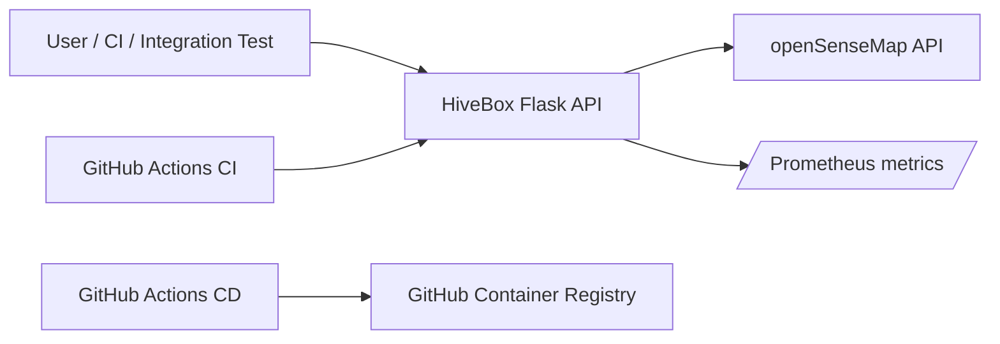
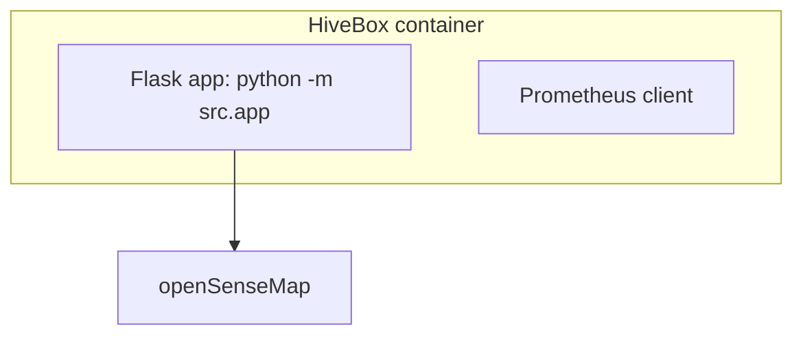
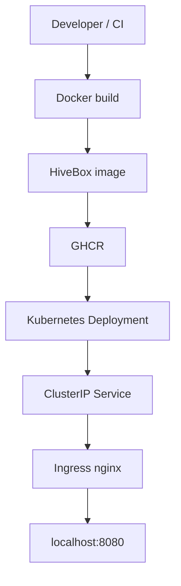

# HiveBox Architecture — hiveBox

Date: 2026-05-15

## 1. Introduction

Purpose: document the current HiveBox architecture from repository evidence. This document reflects the Phase 4 repository state reviewed on 2026-05-15.

## 2. Constraints

- Roadmap source: `devops-roadmap.md`.
- Current reviewed phase: Phase 4 — Kubernetes + CD pipeline.
- Required stack is limited to roadmap/HiveBox-approved tools.
- Unknown or future-phase components are marked as future scope.
- Phase completion requires evidence, not just files.

## 3. System Context

The runtime app is a Flask API in `src/app.py`. It calls openSenseMap for temperature data and exposes default Prometheus metrics through `prometheus-client`.

## 4. Containers

Container evidence:

- `Dockerfile` uses `python:3.12-slim`.
- Runtime dependencies come from `requirements.txt`.
- App source is copied from `src/`.
- Container runs as non-root user `appuser`.
- Port `8080` is exposed.
- `HOST=0.0.0.0` is set for container access.

Docker build was not verified during this review because the local Docker daemon was unavailable.

## 5. Deployment View

Deployment evidence:

- Local Docker deployment is defined by `Dockerfile`.
- CI is defined in `.github/workflows/ci.yml`.
- CD is defined in `.github/workflows/cd.yml` and publishes to `ghcr.io/arashzitaly/hivebox:<tag>`.
- Kubernetes deployment is defined by `k8s/deployment.yaml`.
- Service exposure is defined by `k8s/service.yaml`.
- Local ingress is defined by `k8s/ingress.yaml`.
- KIND node port mappings are defined by `k8s/kind-config.yaml`.

Known deployment risk:

- `k8s/ingress.yaml` uses `nginx.ingress.kubernetes.io/rewrite-target: /`, which likely rewrites endpoint paths to `/` and breaks `/version`, `/temperature`, and `/metrics` through ingress.

## 6. Runtime Behavior

- `/version`: returns `{"version":"0.0.1"}` from the app constant in `src/app.py`.
- `/temperature`: reads configured senseBox IDs, fetches openSenseMap payloads with a five-second timeout, ignores stale measurements older than one hour, averages valid values, and returns a status.
- `/metrics`: returns default Prometheus metrics from `prometheus-client`.
- Future `/store`: not implemented; Phase 5 scope.
- Future `/readyz`: not implemented; Phase 5 scope.

Temperature status behavior:

| Average | Status |
|---|---|
| `< 10` | `Too Cold` |
| `10-36` | `Good` |
| `> 36` | `Too Hot` |

The official Phase 4 text leaves exact `10` and `37` boundary wording slightly ambiguous. The current code treats `10` as `Good` and `37` as `Too Hot`.

## 7. Quality Attributes

| Attribute | Evidence | Gap |
|---|---|---|
| Reliability | Request timeout, stale-data filtering, `503` when no valid data exists, liveness/readiness probes in Kubernetes. | Ingress path behavior likely blocks external endpoint access. |
| Security | Non-root container, no service account token mount, dropped capabilities, no privilege escalation, seccomp defaults, GitHub secrets referenced by name. | CI workflow lacks explicit least-privilege permissions; Scorecard is non-blocking. |
| Observability | `/metrics` exposes default Prometheus metrics. | Custom metrics and Grafana agent are Phase 5 scope and not present. |
| Testability | Unit and integration tests exist; `11 passed` locally. | `/temperature` integration coverage and exact boundary tests can be stronger. |
| Deployability | Dockerfile, CI, CD, KIND config, and Kubernetes manifests exist. | Docker/KIND runtime was not verified in this environment; version tags are inconsistent. |

## 8. Risks and Technical Debt

- Ingress rewrite likely breaks route access through the local Kubernetes entrypoint.
- App version, image tag, Kubernetes image, and git tags are not aligned.
- Dependencies are not pinned, reducing reproducibility.
- README documentation was previously behind Phase 4 implementation; it has now been expanded, but should stay synchronized with future phase changes.
- Phase 5 infrastructure is correctly absent for the current roadmap state and should not be treated as a Phase 4 gap.
