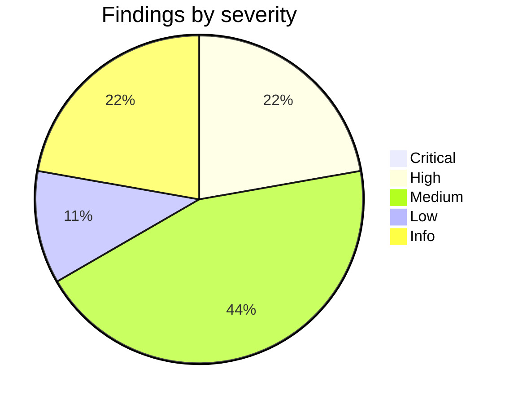

# HiveBox Review Report — hiveBox

Date: 2026-05-15
Reviewer: Codex

## Executive Summary

- Current phase: Phase 4 — Kubernetes + CD pipeline
- Status: partially done
- HiveBox Quality Score: C (68%)
- Top risk: Kubernetes ingress and version evidence are inconsistent enough that Phase 4 cannot be treated as fully verified from repository evidence alone.

## Component Inventory

| Area | Evidence | Notes |
|---|---|---|
| App | `src/app.py` | Flask app exposes `/version`, `/temperature`, and `/metrics`. |
| Tests | `tests/test_app.py`, `tests/test_integration.py` | Unit tests mock openSenseMap; integration tests make local HTTP requests. |
| Docker | `Dockerfile`, `requirements.txt` | Container runs as non-root and binds to `0.0.0.0` through `HOST`. |
| CI/CD | `.github/workflows/ci.yml`, `.github/workflows/cd.yml`, `.github/workflows/scorecard.yml` | CI, CD, Scorecard, SonarQube, and Terrascan workflows exist. |
| Kubernetes | `k8s/deployment.yaml`, `k8s/service.yaml`, `k8s/ingress.yaml`, `k8s/kind-config.yaml` | Deployment, Service, Ingress, and KIND config exist. |
| IaC/Packaging | Not present | Phase 5 scope; not required for Phase 4. |

## Phase Deliverable Evidence

| Deliverable | Required phase | Evidence | Status |
|---|---:|---|---|
| `/version` endpoint | 3 | `src/app.py`, `tests/test_app.py`, `tests/test_integration.py` | partially done |
| `/temperature` endpoint with recent average | 3 | `src/app.py`, `tests/test_app.py` | done |
| Unit tests for endpoints | 3 | `tests/test_app.py`; `11 passed` locally | done |
| Docker best practices | 3 | `Dockerfile` uses slim base, non-root user, and runtime port | partially done |
| CI lint, build, tests, endpoint validation | 3 | `.github/workflows/ci.yml` | done |
| OpenSSF Scorecard | 3 | `.github/workflows/scorecard.yml` | partially done |
| Configurable senseBox IDs | 4 | `SENSEBOX_IDS` in `src/app.py` and `k8s/deployment.yaml` | done |
| `/metrics` endpoint | 4 | `src/app.py`, tests | done |
| `/temperature` status field | 4 | `src/app.py`, parameterized tests | partially done |
| Integration tests | 4 | `tests/test_integration.py` | partially done |
| KIND config with ingress mapping | 4 | `k8s/kind-config.yaml` | partially done |
| Kubernetes core manifests | 4 | `k8s/` manifests | partially done |
| CI SonarQube and Terrascan | 4 | `.github/workflows/ci.yml` | done |
| CD pushes versioned GHCR image | 4 | `.github/workflows/cd.yml` | done |

## Findings by Severity



## Findings

### Critical

None recorded.

### High

- [K8S-001 | High | `k8s/ingress.yaml:9` | Ingress rewrites every request to `/`, so `/version`, `/temperature`, and `/metrics` are likely forwarded to the app as `/` and return 404. | Remove the rewrite annotation or configure path handling so endpoint paths are preserved.]
- [RDM-001 | High | `src/app.py:15`, `k8s/deployment.yaml:26`, git tags | Version evidence is inconsistent: `/version` returns `0.0.1`, Kubernetes deploys `ghcr.io/arashzitaly/hivebox:0.0.1`, while repository tags include later versions such as `v0.0.6`. | Define one version source and align app response, Docker image tags, Kubernetes manifest, and release tags.]

### Medium

- [DOC-001 | Medium | `README.md` | Before this review follow-up, the README documented only Phase 2 behavior and did not show Phase 3/4 API, tests, Docker, Kubernetes, or CI/CD evidence commands. | Keep the expanded README documentation and update it whenever phase evidence changes.]
- [CTR-001 | Medium | `requirements.txt:1`, `requirements-dev.txt:1` | Dependencies are unpinned, so CI and local runs can drift over time. | Pin direct dependencies or document the dependency update policy before claiming reproducible delivery.]
- [CICD-001 | Medium | `.github/workflows/ci.yml:1` | CI has no explicit workflow-level least-privilege `permissions:` block. | Add explicit minimal permissions for the CI workflow.]
- [SEC-001 | Medium | `.github/workflows/scorecard.yml:35` | Scorecard uses `continue-on-error: true`, making the security signal informational rather than blocking. | Decide whether Scorecard is an informational gate or required gate; if required, remove `continue-on-error`.]

### Low

- [APP-001 | Low | `src/app.py:20`, `tests/test_app.py:92` | Temperature boundary behavior for exact `10` and `37` is not fully documented in the source contract. Current code treats `10` as `Good` and `37` as `Too Hot`. | Document and test exact boundary values.]

### Info

- [IAC-001 | Info | repository tree | Terraform, Helm, Kustomize, Valkey, MinIO, Grafana agent, `/store`, and `/readyz` are not present. | This is expected because Phase 5 is still todo in `devops-roadmap.md`.]
- [VER-001 | Info | local environment | Docker daemon was unavailable, `kind` and `hadolint` were not installed, and Kubernetes dry-run validation could not contact a cluster from this environment. | Re-run those checks on a workstation with Docker, KIND, Hadolint, and cluster access.]

## Area Reviews

### 1. Roadmap Scope

`devops-roadmap.md` marks Phase 4 as done and Phase 5 as todo. Repository evidence supports a Phase 4 implementation attempt: app endpoints, tests, Dockerfile, CI/CD workflows, KIND config, and Kubernetes manifests exist. Completion remains partially verified because runtime Docker/KIND evidence was not available in this environment and ingress/version inconsistencies remain.

### 2. Flask API

The app exposes `/version`, `/temperature`, and `/metrics`. `/temperature` reads `SENSEBOX_IDS`, uses a five-second request timeout, ignores stale readings older than one hour, and returns `503` when no valid data exists. The status mapping is implemented, but exact boundary values should be made explicit.

### 3. Tests

The test suite passed locally with `11 passed`. Unit tests cover version, metrics, configurable senseBox IDs, valid temperature values, status categories, and invalid sensor data. Integration tests verify `/version` and `/metrics` over local HTTP. Additional integration coverage for `/temperature` would strengthen Phase 4 evidence.

### 4. Container

The Dockerfile uses `python:3.12-slim`, installs `requirements.txt`, copies `src`, creates a non-root user, exposes `8080`, and sets `HOST=0.0.0.0`. Docker build was not verified because the Docker daemon was unavailable.

### 5. Kubernetes

The required Phase 4 files exist: Deployment, Service, Ingress, and KIND config. Labels and selectors match, container and service ports align, senseBox IDs are injected through environment variables, probes exist, resources are set, and security context is hardened. The ingress rewrite annotation is a likely functional blocker for endpoint access.

### 6. CI/CD

CI includes Python lint, Dockerfile lint, Docker build, tests, `/version` validation, SonarQube, and Terrascan. CD publishes versioned images to GHCR on semver-like tags. Scorecard exists and uploads SARIF, but it is configured as non-blocking.

### 7. Security

No plaintext secret values were found during a simple repository scan. Workflow secrets are referenced by name only. Kubernetes manifests disable service account token mounting, drop capabilities, disallow privilege escalation, run as non-root, and set seccomp defaults. CI permissions should still be made explicit.

### 8. IaC and Observability

Phase 4 observability is present through `/metrics` and default Prometheus client metrics. Phase 5 infrastructure and observability components are not present and are correctly treated as future scope.

## Remediation Plan

| Priority | Action | Owner | Evidence required |
|---|---|---|---|
| High | Fix ingress path handling so `/version`, `/temperature`, and `/metrics` work through local ingress. | Project owner | `kubectl apply`, rollout output, and successful `curl http://localhost:8080/version`. |
| High | Align app version, image tag, Kubernetes image, and git release tag. | Project owner | `/version` response, image tag, manifest, and release tag match the chosen version. |
| Medium | Pin dependencies or document dependency update policy. | Project owner | Updated dependency files and passing CI. |
| Medium | Add explicit CI workflow permissions. | Project owner | Updated `.github/workflows/ci.yml` and passing CI. |
| Medium | Decide whether Scorecard is required or informational. | Project owner | Updated workflow behavior and documented gate policy. |
| Low | Add exact boundary tests for `10` and `37`. | Project owner | Passing parameterized tests covering boundary values. |

## Verification

Commands or evidence checked:

```text
bash ai-hivebox-review/scripts/analyze-hivebox.sh /Users/arash/Downloads/ToDo/hiveBox
/private/tmp/hivebox-review-venv/bin/python -m pytest -q
/private/tmp/hivebox-review-venv/bin/pylint src/app.py
rg -n "(password|secret|token|api[_-]?key|GHCR_PAT|SONAR_TOKEN|BEGIN [A-Z ]*PRIVATE KEY)" -S . --glob '!./.git/**'
git status --short --branch
git log --oneline --decorate -5
docker build -t hivebox:review .
kubectl apply --dry-run=client -f k8s
kubectl apply --dry-run=client --validate=false -f k8s
kind version
hadolint Dockerfile
```

Results:

```text
Inventory: app, tests, Dockerfile, workflows, roadmap, and k8s files present.
Tests: 11 passed.
Pylint: 10.00/10, with local cache write warnings only.
Secret scan: no plaintext secret values found; only expected secret references and TLS secret name matched.
Docker build: not verified because Docker daemon was unavailable.
Kubernetes dry run: not verified because cluster API access was unavailable from this environment.
kind: not installed.
hadolint: not installed.
```
